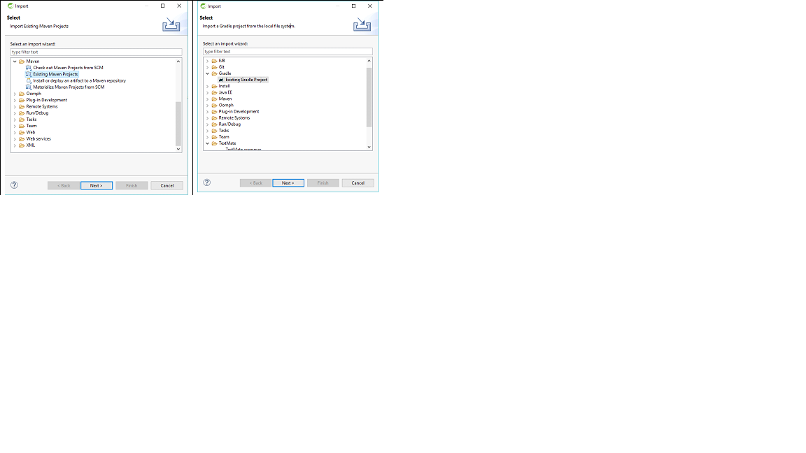

# Problem 12: Importing your project in STS Maven - Gradle

For the very begginer, you should start by downloading the project from GitHub 

 

and taking a look at it in your IDE:

Follow the instructions of your IDE or watch one of the many Youtube videos.